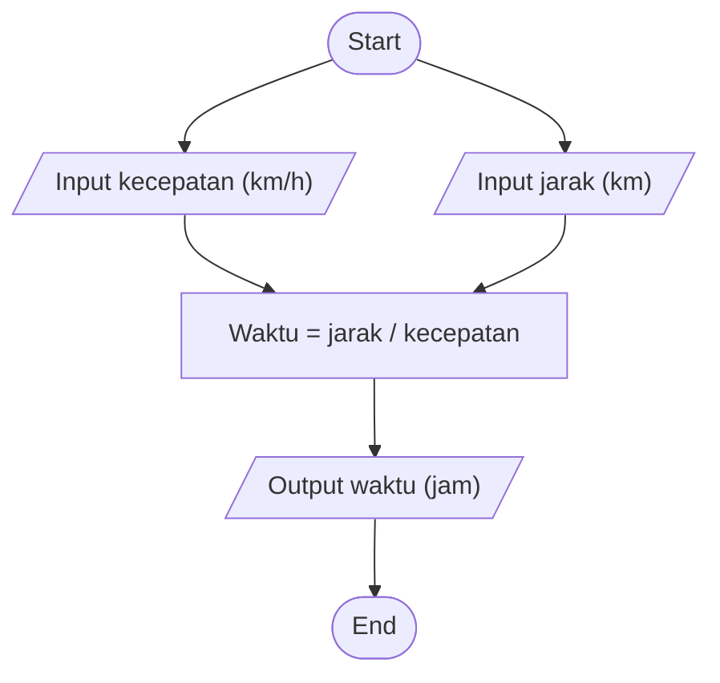
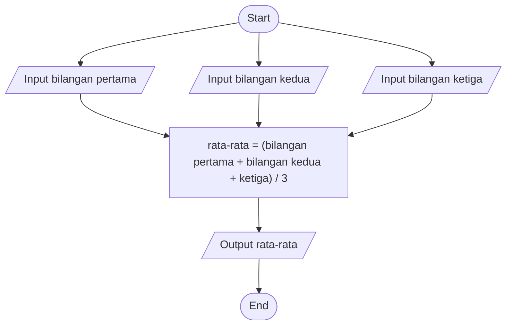
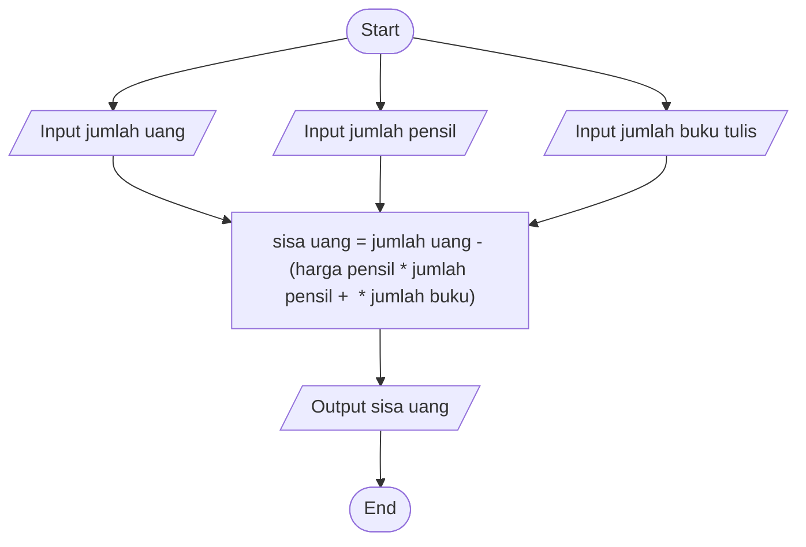
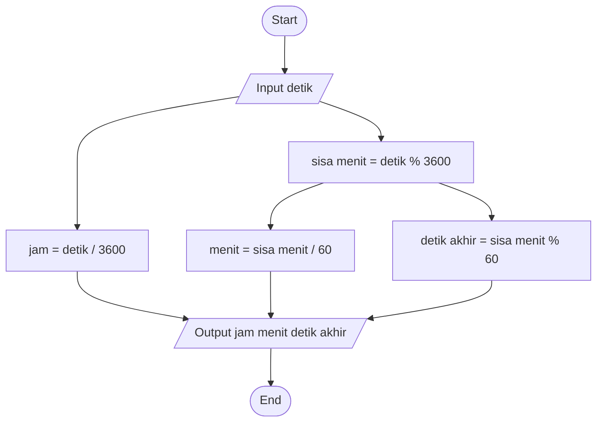

# time.cpp

```mermaid
flowchart TD
    Start([Start])
    InputSpeed[/"Input kecepatan (km/h)"/]
    InputDistance[/"Input jarak (km)"/]
    CalcTime["Waktu = jarak / kecepatan"]
    OutputTime[/"Output waktu (jam)"/]
    End([End])

    Start --> InputSpeed
    Start --> InputDistance
    InputSpeed --> CalcTime
    InputDistance --> CalcTime
    CalcTime --> OutputTime
    OutputTime --> End
```

# average.cpp

```mermaid
flowchart TD
    A([Start]) --> B[/"Input bilangan pertama"/]
    A --> C[/"Input bilangan kedua"/]
    A --> D[/"Input bilangan ketiga"/]
    B --> E["rata-rata = (bilangan pertama + bilangan kedua + ketiga) / 3"]
    C --> E
    D --> E
    E --> F[/"Output rata-rata"/]
    F --> G([End])
```

# moneyRemainder.cpp

```mermaid
flowchart TD
    A([Start]) --> B[/"Input jumlah uang"/]
    A --> C[/"Input jumlah pensil"/]
    A --> D[/"Input jumlah buku tulis"/]
    B --> E["sisa uang = jumlah uang - (harga pensil * jumlah pensil +  * jumlah buku)"]
    C --> E
    D --> E
    E --> F[/"Output sisa uang"/]
    F --> G([End])
```

# seconds.cpp

```mermaid
flowchart TD
    A([Start]) --> B[/"Input detik"/]
    B --> C["jam = detik / 3600"]
    B --> D["sisa menit = detik % 3600"]
    D --> E["menit = sisa menit / 60"]
    D --> F["detik akhir = sisa menit % 60"]
    C --> G[/"Output jam menit detik akhir"/]
    E --> G
    F --> G
    G --> H([End])
```